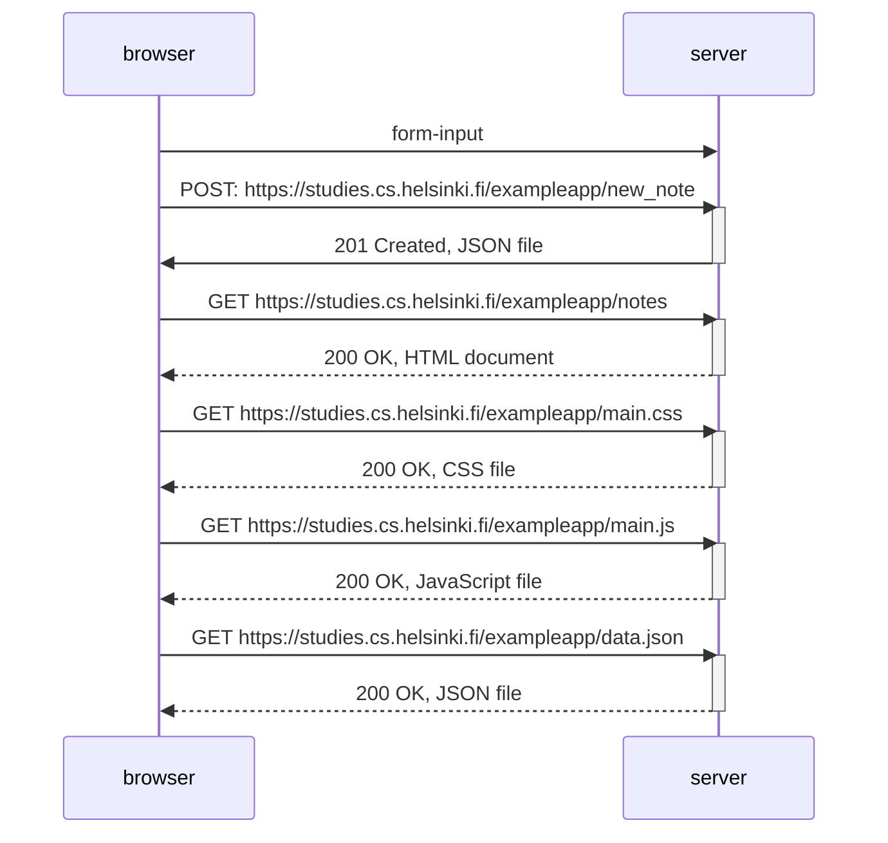

```mermaid
sequenceDiagram

    participant browser
    participant server

    browser ->> server: form-input

    browser ->> server: POST: https://studies.cs.helsinki.fi/exampleapp/new_note
    activate server
    server ->> browser: 201 Created, JSON file
    deactivate server

    browser->>server: GET https://studies.cs.helsinki.fi/exampleapp/notes
    activate server
    server-->>browser: 200 OK, HTML document
    deactivate server

    browser->>server: GET https://studies.cs.helsinki.fi/exampleapp/main.css
    activate server
    server-->>browser: 200 OK, CSS file
    deactivate server

    browser->>server: GET https://studies.cs.helsinki.fi/exampleapp/main.js
    activate server
    server-->>browser: 200 OK, JavaScript file
    deactivate server

    browser->>server: GET https://studies.cs.helsinki.fi/exampleapp/data.json
    activate server
    server-->>browser: 200 OK, JSON file
    deactivate server

```